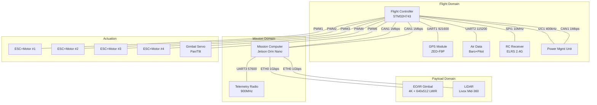

# ICD (Interface Control Document) 자동 생성 시스템 구상

**ICD** — Interface Control Document
장비 간 인터페이스(신호, 메시지, 버스, 프로토콜)를 정의하는 설계 문서.

> 기존 방식: Excel/DOORS 수기 작성 → **자동 생성 + 계산 검증**으로 대체

---

> **본 문서의 모든 예시는 실제 드론 개발 환경을 기준으로 구성됨**
> 기체: 중형 쿼드콥터 (MTOW ~5kg) / 임무: 정찰·감시

---

## 목차

1. [시스템 개요 — 드론 ICD 전장](#1-시스템-개요--드론-icd-전장)
2. [계층 구조: 마인드맵에서 최하위까지](#2-계층-구조-마인드맵에서-최하위까지)
3. [장비 정의 (Equipment)](#3-장비-정의-equipment)
4. [버스 정의 (Interface / Bus)](#4-버스-정의-interface--bus)
5. [메시지 + 신호 정의 (Message / Signal)](#5-메시지--신호-정의-message--signal)
6. [매트릭스 뷰: Message × Bus Matrix](#6-매트릭스-뷰-message--bus-matrix)
7. [계산 엔진 — 자동 계산되는 값들](#7-계산-엔진--자동-계산되는-값들)
8. [출력 생성 — 자동 생성 문서](#8-출력-생성--자동-생성-문서)
9. [YAML 입력 예시 — 전체 프로젝트](#9-yaml-입력-예시--전체-프로젝트)
10. [실행 결과 리포트 예시](#10-실행-결과-리포트-예시)
11. [시스템 추천 및 경고 시나리오](#11-시스템-추천-및-경고-시나리오)
12. [변경 영향도 분석 (What-If)](#12-변경-영향도-분석-what-if)
13. [개발 난이도](#13-개발-난이도)
14. [확장 아이디어](#14-확장-아이디어)

---

## 1. 시스템 개요 — 드론 ICD 전장

```
                         ┌─────────────────────────────────────────┐
                         │          PAYLOAD / MISSION              │
                         │  ┌──────────┐    ┌──────────────────┐   │
                         │  │EO/IR Gim│    │   LiDAR (Livox)   │   │
                         │  │ 640×512 │    │   Mid-360 10Hz    │   │
                         │  │  30 fps  │    │   ±360° × 59°    │   │
                         │  └────┬─────┘    └────────┬─────────┘   │
                         │       └────────┬──────────┘              │
                         │                │ GigE Vision             │
                         └────────────────┼────────────────────────┘
                                          │
                    ┌─────────────────────┼─────────────────────┐
                    │                     │                     │
              ┌─────┴─────┐        ┌──────┴──────┐       ┌────┴────┐
              │  Mission   │        │   Flight    │       │   RC    │
              │  Computer  │◄─CAN1─►│  Controller │◄─SPI──│Receiver │
              │ Jetson Orin│        │  STM32H743  │       │ ELRS 2.4│
              │  Nano 8GB  │        │  FreeRTOS   │       └─────────┘
              └─────┬─────┘        └──────┬───────┘
                    │                     │
              ┌─────┴─────┐        ┌──────┴───────┐
              │Telemetry   │        │  GPS/GNSS     │
              │Radio 900MHz│        │  ZED-F9P      │
              │  UART3     │        │  UART1 921600  │
              └───────────┘        └───────────────┘
                                         │
                                    ┌────┴───────┐
                                    │  Air Data   │
                                    │  Baro+Pitot  │
                                    │  UART2 115200│
                                    └────────────┘

     ┌────────────────────────────────────────────────────────────────┐
     │                     ACTUATION / POWER                          │
     │  ┌──────┐  ┌──────┐  ┌──────┐  ┌──────┐  ┌──────┐  ┌───────┐ │
     │  │ESC/M1│  │ESC/M2│  │ESC/M3│  │ESC/M4│  │Gimbal│  │ PMU   │ │
     │  │  PWM1 │  │  PWM2 │  │  PWM3 │  │  PWM4 │  │Servo │  │CAN1+I2C│
     │  └──────┘  └──────┘  └──────┘  └──────┘  └──────┘  └───────┘ │
     └────────────────────────────────────────────────────────────────┘
```

---

## 2. 계층 구조: 마인드맵에서 최하위까지

```
┌─ SYSTEM LEVEL ──────────────────────────────────────────────────────────┐
│  [L5] System: Surveillance Quadcopter v1.0                              │
│  Bus: CAN1(1M) ETH0(1G) UART1(921600) UART2(115200) UART3(57600)       │
│  Total bus utilization, cross-domain timing validation                  │
└─────────────────────────────────────────────────────────────────────────┘
                                    │
          ┌─────────────────────────┼─────────────────────────┐
          ▼                         ▼                         ▼
┌──────────────────┐    ┌──────────────────┐    ┌──────────────────┐
│ [L4] Flight      │    │ [L4] Mission     │    │ [L4] Payload     │
│ Domain           │    │ Domain           │    │ Domain           │
├──────────────────┤    ├──────────────────┤    ├──────────────────┤
│ Flight Ctrl      │    │ Mission Computer │    │ EO/IR Gimbal     │
│ GPS              │    │ Telemetry Radio  │    │ LiDAR            │
│ Air Data         │    │                  │    │                  │
│ RC Receiver      │    │                  │    │                  │
│ PMU              │    │                  │    │                  │
│ 4× ESC+Motor     │    │                  │    │                  │
└──────────────────┘    └──────────────────┘    └──────────────────┘
          │                      │                      │
          ▼                      ▼                      ▼
┌──────────────────┐    ┌──────────────────┐    ┌──────────────────┐
│ [L3] Flight      │    │ [L3] Mission     │    │ [L3] EO/IR       │
│ Controller       │    │ Computer         │    │ Gimbal Camera    │
│ (STM32H743)      │    │ (Jetson Orin N)  │    │                  │
├──────────────────┤    ├──────────────────┤    ├──────────────────┤
│ CAN1: 1Mbps      │    │ CAN1: 1Mbps      │    │ ETH0: 1Gbps      │
│ PWM1~4: 50Hz     │    │ ETH0: 1Gbps      │    │ UART: 115200     │
│ PWM6: 50Hz       │    │ UART3: 57600     │    │                  │
│ SPI1: 10MHz      │    │                  │    │                  │
│ UART1: 921600    │    │                  │    │                  │
│ UART2: 115200    │    │                  │    │                  │
│ I2C1: 400kHz     │    │                  │    │                  │
└──────────────────┘    └──────────────────┘    └──────────────────┘
          │                      │                      │
          ▼                      ▼                      ▼
┌──────────────────┐    ┌──────────────────┐    ┌──────────────────┐
│ [L2] CAN1 Bus    │    │ [L2] ETH0 Bus    │    │ [L2] UART1 Bus   │
│ 1 Mbps           │    │ 1 Gbps           │    │ 921600 bps       │
├──────────────────┤    ├──────────────────┤    ├──────────────────┤
│ IMU_Data 200Hz   │    │ Video_Stream     │    │ GPS_Data 10Hz    │
│ Mag_Data 50Hz    │    │  30fps 900KB     │    │ GPS_Raw 20Hz     │
│ Baro_Data 25Hz   │    │ LiDAR_PointCloud │    │ RTCM_Correction  │
│ Batt_Status 10Hz │    │  10Hz 40KB       │    │  5Hz 100B        │
│ Sys_Health 1Hz   │    │ LiDAR_IMU 100Hz  │    │                  │
│ Control_Cmd 100Hz│    │  100B            │    │                  │
│ Mission_Cmd 10Hz │    │                  │    │                  │
│ Utill: 5.95% ✅  │    │ Util: 27.2% ✅   │    │ Util: 6.8% ✅    │
└──────────────────┘    └──────────────────┘    └──────────────────┘
          │
          ▼
┌─────────────────────────────────────────────────────────────────────┐
│ [L1] Message: IMU_Data (ID: 0x100) 32 bytes @ 200Hz               │
│ Direction: TX (FC → Mission Computer)  Priority: 1  Deadline: 10ms │
├─────────────────────────────────────────────────────────────────────┤
│ [L0] Signal Table:                                                  │
│ Offset│ Size│ Type   │ Name         │ Unit    │ Range     │ Res.   │
│ 0     │ 32  │ float  │ accel_x      │ m/s²    │ ±16g      │ 0.001  │
│ 32    │ 32  │ float  │ accel_y      │ m/s²    │ ±16g      │ 0.001  │
│ 64    │ 32  │ float  │ accel_z      │ m/s²    │ ±16g      │ 0.001  │
│ 96    │ 32  │ float  │ gyro_x       │ °/s     │ ±2000     │ 0.01   │
│ 128   │ 32  │ float  │ gyro_y       │ °/s     │ ±2000     │ 0.01   │
│ 160   │ 32  │ float  │ gyro_z       │ °/s     │ ±2000     │ 0.01   │
│ 192   │ 16  │ int16  │ temp         │ °C      │ -40~85    │ 0.01   │
│ 208   │ 8   │ uint8  │ status       │ —       │ 0~255     │ 1      │
│ 216   │ 40  │ —      │ PADDING      │ —       │ —         │ —      │
│ TOTAL │ 256 │        │ 32 bytes     │         │           │        │
└─────────────────────────────────────────────────────────────────────┘
```

---

## 3. 장비 정의 (Equipment)

드론을 구성하는 **11개 장비**와 그 상세 명세.

### 3.1 Flight Controller (비행제어)

| 항목 | 값 |
|---|---|
| **ID** | `flight_ctrl` |
| **카테고리** | 비행제어 |
| **MCU** | STM32H743 (Cortex-M7, 480 MHz) |
| **RAM** | 1 MB (내부) + 8 MB 외부 SRAM |
| **OS** | FreeRTOS v10.5, task priority 0~31 |
| **Firmware** | PX4 / ArduPilot (custom) |
| **인터페이스** | CAN 1ch, UART 4ch, SPI 2ch, I2C 2ch, PWM 8ch, SBUS, USB |
| **전력** | 5V / 500mA (BEC) |
| **역할** | 센서 융합(EKF), 자세/위치 제어, 모터 믹싱, RC 입력 처리 |

### 3.2 Mission Computer (임무 컴퓨터)

| 항목 | 값 |
|---|---|
| **ID** | `mission_comp` |
| **카테고리** | 저장/처리 |
| **CPU** | Jetson Orin Nano 8GB (6-core Cortex-A78AE, 1024-core Ampere GPU) |
| **RAM** | 8 GB LPDDR5, 64 GB eMMC |
| **OS** | Ubuntu 22.04 LTS (JetPack 6.0) / ROS2 Humble |
| **인터페이스** | GigE, CAN, UART × 2, USB 3.0, HDMI, PCIe, M.2 NVMe |
| **전력** | 5V / 15W (추정), BEC 또는 PMU 전용 레일 |
| **역할** | 비디오 처리 (CV/DNN), LiDAR 포인트클라우드 처리, waypoint navigation, 임무 관리, 데이터 로깅, 지상국 통신 |

### 3.3 GNSS / GPS (위치 측위)

| 항목 | 값 |
|---|---|
| **ID** | `gps_module` |
| **카테고리** | 센서 |
| **칩셋** | u-blox ZED-F9P (multi-band GNSS) |
| **Position Accuracy** | 0.01 m (RTK fix) / 1.0 m (standalone) |
| **Max Rate** | 20 Hz (PVT) / 10 Hz (RAW) |
| **인터페이스** | UART (최대 921600 bps) |
| **프로토콜** | NMEA 0183 / UBX binary |
| **전력** | 3.3V / 150mA |

### 3.4 Air Data Module (대기 데이터)

| 항목 | 값 |
|---|---|
| **ID** | `air_data` |
| **카테고리** | 센서 |
| **센서 구성** | MS5611 barometer (±10 cm), pitot-static tube (Sensirion SDP3x) |
| **Baro Rate** | 25 Hz |
| **Airspeed Rate** | 50 Hz |
| **인터페이스** | UART (115200 bps) 또는 I2C |
| **전력** | 3.3V / 50mA |

### 3.5 RC Receiver (수동 조종 수신기)

| 항목 | 값 |
|---|---|
| **ID** | `rc_receiver` |
| **카테고리** | 통신 |
| **프로토콜** | ExpressLRS 2.4 GHz / SBUS |
| **Rate** | SBUS frame: 100 Hz (11ms), 16 channels |
| **인터페이스** | SPI (FC의 SBUS decoder) / UART (inverted) |
| **Range** | 10 km (LoRa mode), 200 m (500 Hz mode) |
| **전력** | 3.3V / 100mA |

### 3.6 EO/IR Gimbal Camera (전자광학/적외선 짐벌)

| 항목 | 값 |
|---|---|
| **ID** | `eo_ir_gimbal` |
| **카테고리** | 영상 |
| **EO 센서** | 4K RGB (3840×2160), 30 fps, Sony IMX334 |
| **IR 센서** | 640×512 LWIR (Uncooled microbolometer), 30 fps, FLIR Tau 2 |
| **스트림 출력** | GigE Vision / RTSP over Ethernet |
| **Gimbal control** | UART (115200 bps), Pelco-D protocol |
| **Gimbal range** | Pan ±360°, Tilt ±90° |
| **전력** | 12V / 15W (heater 포함) |

### 3.7 LiDAR (3D 라이다)

| 항목 | 값 |
|---|---|
| **ID** | `lidar_sensor` |
| **카테고리** | 영상 |
| **모델** | Livox Mid-360 |
| **Range** | 40 m @ 10% reflectivity, 100 m @ 80% |
| **FOV** | 360° × 59° (non-repeating scan) |
| **Point Rate** | 200,000 pts/s |
| **Output Rate** | 10 Hz (point cloud publish) / 100 Hz (IMU built-in) |
| **인터페이스** | GigE Ethernet / UDP packet |
| **전력** | 5V / 10W |

### 3.8 Telemetry Radio (지상국 데이터링크)

| 항목 | 값 |
|---|---|
| **ID** | `telemetry_radio` |
| **카테고리** | 통신 |
| **주파수** | 900 MHz (ISM band) / 2.4 GHz 옵션 |
| **프로토콜** | MAVLink 2 (UDP over SiK / HolyBro) |
| **Air Rate** | 설정 가능: 250 kbps ~ 10 Mbps (모드 의존) |
| **Range** | 30 km (LoRa 250 kbps), 5 km (GFSK 1 Mbps) |
| **인터페이스** | UART (57600~921600 bps) |
| **전력** | 5V / 1W (TX power 최대) |

### 3.9 Power Management Unit (전력 관리)

| 항목 | 값 |
|---|---|
| **ID** | `pmu` |
| **카테고리** | 전력 |
| **측정 항목** | 전압(6S LiPo), 전류, consumed mAh, 각 레일별 상태 |
| **Sample Rate** | 10 Hz (평균), 100 Hz (순시 전류 — 보호용) |
| **인터페이스** | CAN (메시지 전송) + I2C (로컬 디버그) |
| **전력** | Self-powered from main battery |

### 3.10 4× ESC + Motor (추진)

| 항목 | 값 |
|---|---|
| **ID** | `esc_motor_01~04` |
| **카테고리** | 제어 |
| **ESC 타입** | BLHeli_32 / AM32 (PWM or DShot1200) |
| **PWM Rate** | 50 Hz (standard) / up to 500 Hz (oneshot) |
| **모터** | 2806.5 1300KV, 12S max |
| **인터페이스** | PWM (FC → ESC) |
| **전력** | 6S LiPo (22.2V nom), 40A continuous each |

### 3.11 Gimbal Servo Controller (짐벌 구동)

| 항목 | 값 |
|---|---|
| **ID** | `gimbal_servo` |
| **카테고리** | 제어 |
| **서보** | 고토크 브러시리스 짐벌 모터 × 2 (Pan/Tilt) |
| **PWM Rate** | 50 Hz (standard servo PWM) |
| **범위** | 1000~2000 μs (1500 μs = Center) |
| **인터페이스** | PWM (FC → Servo) |
| **전력** | 5V / 2A (BEC 별도) |

---

## 4. 버스 정의 (Interface / Bus)

### 4.1 CAN1 (Flight Domain Internal Bus)

| 항목 | 값 |
|---|---|
| **타입** | CAN 2.0B (ISO 11898) |
| **속도** | 1 Mbps |
| **프로토콜** | Custom — 11-bit ID, Data Length ≤ 8 bytes |
| **종단** | 120Ω × 2 (양단) |
| **참여 장비** | Flight Controller (master), Mission Computer, PMU |
| **특이사항** | 우선순위 기반 arbitration. ID 낮을수록 높은 우선순위 |

**물리 계층 상세:**

| 파라미터 | 값 |
|---|---|
| Bus length | 0.5 m (기체 내부) |
| Bit time | 1 μs |
| Sample point | 75% (750 ns) |
| Sync jump width | 1 tq |
| Bus state | Hidden/Dominant, differential |

### 4.2 ETH0 (Payload High-Bandwidth Link)

| 항목 | 값 |
|---|---|
| **타입** | Gigabit Ethernet (1000BASE-T) |
| **속도** | 1 Gbps full-duplex |
| **프로토콜** | UDP / TCP (GigE Vision, RTSP) |
| **참여 장비** | Mission Computer (switch), EO/IR Gimbal, LiDAR |
| **스위치** | 내장 GbE switch (Jetson Orin Nano 내장) |

### 4.3 UART1 (GPS 전용)

| 항목 | 값 |
|---|---|
| **타입** | UART 8N1 |
| **속도** | 921600 bps |
| **연결** | Flight Controller ←→ GPS Module |
| **프로토콜** | u-blox UBX binary |
| **흐름 제어** | 없음 |

**전송 효율:**
```
921600 bps = 921600 / (8 + 1 start + 1 stop) = 92,160 bytes/s ≈ 90 KB/s
```

### 4.4 UART2 (Air Data 전용)

| 항목 | 값 |
|---|---|
| **타입** | UART 8N1 |
| **속도** | 115200 bps |
| **연결** | Flight Controller ←→ Air Data Module |
| **흐름 제어** | 없음 |

### 4.5 UART3 (Telemetry 전용)

| 항목 | 값 |
|---|---|
| **타입** | UART 8N1 |
| **속도** | 57600 bps |
| **연결** | Mission Computer ←→ Telemetry Radio |
| **프로토콜** | MAVLink 2 |
| **흐름 제어** | RTS/CTS (half-duplex radio 특성) |

### 4.6 SPI1 (RC Receiver)

| 항목 | 값 |
|---|---|
| **타입** | SPI Mode 3 (CPOL=1, CPHA=1) |
| **속도** | 10 MHz (SCLK) |
| **연결** | Flight Controller (master) → RC Receiver (slave) |
| **프로토콜** | Custom SBUS decoder via SPI |

### 4.7 I2C1 (PMU Local Debug)

| 항목 | 값 |
|---|---|
| **타입** | I2C (7-bit addressing) |
| **속도** | 400 kHz (Fast mode) |
| **연결** | Flight Controller (master) → PMU (slave @ 0x42) |
| **용도** | PMU 설정 레지스터 R/W, 진단 |

### 4.8 PWM1~4 (ESC → Motor)

| 항목 | 값 |
|---|---|
| **타입** | Standard PWM (Digital protocol DShot1200 option) |
| **주파수** | 50 Hz (20ms period) |
| **Pulse** | 1000 μs (min throttle) ~ 2000 μs (max throttle), 1500 μs (idle, arming) |
| **분해능** | 1 μs (1% ~ 2% resolution at 50 Hz) |
| **연결** | Flight Controller → ESC #1~4 |

### 4.9 PWM6 (Gimbal Servo Pan/Tilt)

| 항목 | 값 |
|---|---|
| **타입** | Standard PWM |
| **주파수** | 50 Hz (20ms period) |
| **Pulse** | Pan: 1000 μs (CCW) ~ 2000 μs (CW), 1500 μs (Center) |
| | Tilt: 1000 μs (Up) ~ 2000 μs (Down), 1500 μs (Level) |
| **연결** | Flight Controller → Gimbal Servo Controller |

---

## 5. 메시지 + 신호 정의 (Message / Signal)

### 5.1 IMU_Data (CAN1, 32 bytes @ 200 Hz)

**Message Info:**

| 항목 | 값 |
|---|---|
| **Bus** | CAN1 |
| **CAN ID** | 0x100 (11-bit) |
| **Source** | Flight Controller |
| **Target** | Mission Computer |
| **방향** | TX |
| **주기** | 5 ms (= 200 Hz) |
| **우선순위** | 1 (가장 높음 — CAN arbitration 우선) |
| **최대 지연** | 10 ms (deadline) |
| **전체 크기** | 32 bytes |

**Signal Layout (CAN은 8바이트 제한 → 4帧 연속 전송):**

| Frame | Offset | Size | Type | Name | Unit | Range | Resolution | Description |
|---|---|---|---|---|---|---|---|---|
| #1 (ID 0x100) | 0 | 32 | float32 | accel_x | m/s² | ±16g (156.8) | 0.001 | Accelerometer X-axis |
| #1 | 32 | 32 | float32 | accel_y | m/s² | ±16g | 0.001 | Accelerometer Y-axis |
| **Frame 1 total: 8 bytes** | | | | | | | | |
| #2 (ID 0x101) | 0 | 32 | float32 | accel_z | m/s² | ±16g | 0.001 | Accelerometer Z-axis |
| #2 | 32 | 32 | float32 | gyro_x | °/s | ±2000 | 0.01 | Gyroscope X-axis |
| **Frame 2 total: 8 bytes** | | | | | | | | |
| #3 (ID 0x102) | 0 | 32 | float32 | gyro_y | °/s | ±2000 | 0.01 | Gyroscope Y-axis |
| #3 | 32 | 32 | float32 | gyro_z | °/s | ±2000 | 0.01 | Gyroscope Z-axis |
| **Frame 3 total: 8 bytes** | | | | | | | | |
| #4 (ID 0x103) | 0 | 16 | int16 | temp | °C | -40~85 | 0.01 | IMU die temperature |
| #4 | 16 | 8 | uint8 | status | — | 0~255 | 1 | Status flags (bits: 0=accel_ok, 1=gyro_ok, 2=temp_warn, 3~7 reserved) |
| #4 | 24 | 8 | uint8 | seq_num | — | 0~255 | 1 | Sequence number (0-255 rollover) |
| #4 | 32 | 32 | float32 | accel_norm | m/s² | — | 0.001 | sqrt(x²+y²+z²) pre-calculated |
| **Frame 4 total: 8 bytes** | | | | | | | | |

> **ICD 자동 생성기가 수행할 작업:**
> - 32바이트의 신호 목록 → CAN 8바이트 프레임 4개로 **자동 분할**
> - 각 프레임에 CAN ID 자동 할당 (0x100~0x103)
> - PADDING이 필요한 위치 자동 계산
> - 우선순위 기반 CAN arbitration ID 할당

### 5.2 Mag_Data (CAN1, 8 bytes @ 50 Hz)

| 항목 | 값 |
|---|---|
| **CAN ID** | 0x110 |
| **Source** | Flight Controller |
| **Target** | Mission Computer, (자체 EKF에도 사용) |
| **주기** | 20 ms (= 50 Hz) |
| **우선순위** | 2 |
| **크기** | 8 bytes (1 frame) |

| Offset | Size | Type | Name | Unit | Range | Resolution |
|---|---|---|---|---|---|---|
| 0 | 32 | float32 | mag_x | gauss | ±4.9 | 0.001 |
| 32 | 32 | float32 | mag_y | gauss | ±4.9 | 0.001 |
| 64 | — | — | — | — | — | — |

> ⚠️ **충돌 감지**: mag_z가 64바이트부터 시작하려면 8바이트 CAN 프레임을 초과.
> → **ICD 계산기가 자동으로 경고**: "Mag_Data 메시지에 mag_z를 포함하려면 CAN 프레임 2필요. mag_z를 분리하여 ID 0x111에 할당 권장"

### 5.3 Baro_Data (CAN1, 8 bytes @ 25 Hz)

| 항목 | 값 |
|---|---|
| **CAN ID** | 0x120 |
| **Source** | Flight Controller (Air Data Module raw data → FC 처리) |
| **Target** | Mission Computer |
| **주기** | 40 ms (= 25 Hz) |
| **우선순위** | 4 |
| **크기** | 8 bytes |

| Offset | Size | Type | Name | Unit | Range | Resolution |
|---|---|---|---|---|---|---|
| 0 | 32 | float32 | pressure | hPa | 300~1200 | 0.01 |
| 32 | 16 | int16 | temperature | °C | -40~85 | 0.01 |
| 48 | 16 | uint16 | altitude_raw | cm | 0~50000 | 1 |
| 64 | — | — | — | — | — | — |

### 5.4 Batt_Status (CAN1, 8 bytes @ 10 Hz)

| 항목 | 값 |
|---|---|
| **CAN ID** | 0x130 |
| **Source** | PMU |
| **Target** | Flight Controller, Mission Computer |
| **주기** | 100 ms (= 10 Hz) |
| **우선순위** | 5 |
| **크기** | 8 bytes |

| Offset | Size | Type | Name | Unit | Range | Resolution |
|---|---|---|---|---|---|---|
| 0 | 16 | uint16 | voltage | mV | 0~30000 | 1 |
| 16 | 16 | int16 | current | mA | -20000~20000 | 1 |
| 32 | 16 | uint16 | consumed_mAh | mAh | 0~65535 | 1 |
| 48 | 8 | uint8 | battery_percent | % | 0~100 | 1 |
| 56 | 8 | uint8 | status_flags | — | — | bit0: charging, bit1: low, bit2: critical, bit3: cell_balance_active |

### 5.5 Sys_Health (CAN1, 8 bytes @ 1 Hz)

| 항목 | 값 |
|---|---|
| **CAN ID** | 0x140 |
| **Source** | Flight Controller |
| **Target** | Mission Computer (지상국 중계용) |
| **주기** | 1000 ms (= 1 Hz) |
| **우선순위** | 7 |
| **크기** | 8 bytes |

| Offset | Size | Type | Name | Unit | Range | Description |
|---|---|---|---|---|---|---|
| 0 | 8 | uint8 | system_mode | — | 0~255 | 0=INIT, 1=STANDBY, 2=ARMED, 3=AUTO, 4=RTL, 5=LAND, 6=MANUAL |
| 8 | 8 | uint8 | arming_status | — | 0~255 | 0=DISARMED, 1=ARMED, 2=ARMING_FAIL |
| 16 | 8 | uint8 | ekf_status | — | 0~255 | bit0: GPS_fix, bit1: baro_ok, bit2: mag_ok, bit3: airspeed_ok |
| 24 | 8 | uint8 | num_satellites | — | 0~255 | |
| 32 | 16 | uint16 | flight_time | s | 0~65535 | 누적 비행 시간 (초) |
| 48 | 8 | uint8 | cpu_load | % | 0~100 | FC CPU 점유율 |
| 56 | 8 | uint8 | max_chan_usage | % | 0~100 | CAN bus 최대 채널 점유율 |

### 5.6 Control_Cmd (CAN1, 8 bytes @ 100 Hz)

| 항목 | 값 |
|---|---|
| **CAN ID** | 0x150 |
| **Source** | Mission Computer (autonomous mode) |
| **Target** | Flight Controller |
| **방향** | RX (Mission Computer → FC 입장에서 TX) |
| **주기** | 10 ms (= 100 Hz) |
| **우선순위** | 3 |
| **크기** | 8 bytes |

| Offset | Size | Type | Name | Unit | Range | Description |
|---|---|---|---|---|---|---|
| 0 | 32 | float32 | roll_target | deg | -45~45 | Target roll angle |
| 32 | 32 | float32 | pitch_target | deg | -45~45 | Target pitch angle |
| 64 | — | — | — | — | — | — |

> ⚠️ **또 다른 충돌**: yaw_target과 thrust_target을 넣으려면 1 frame 초과.
> → ICD가 **"Control_Cmd에 신호를 모두 담으려면 CAN 2필요. 우선순위 고려 시 다음 옵션"** 자동 제안

### 5.7 Mission_Cmd (CAN1, 8 bytes @ 10 Hz)

| 항목 | 값 |
|---|---|
| **CAN ID** | 0x160 |
| **Source** | Mission Computer |
| **Target** | Flight Controller |
| **방향** | RX |
| **주기** | 100 ms (= 10 Hz) |
| **우선순위** | 6 |
| **크기** | 8 bytes |

| Offset | Size | Type | Name | Unit | Range | Description |
|---|---|---|---|---|---|---|
| 0 | 8 | uint8 | mission_type | — | 0~255 | 0=NONE, 1=WAYPOINT, 2=LOITER, 3=RTL, 4=LAND, 5=TAKEOFF, 6=SEARCH |
| 8 | 16 | uint16 | waypoint_index | — | 0~65535 | Current target waypoint index |
| 24 | 16 | int16 | loiter_radius | m | 0~500 | Loiter radius (if mission_type=2) |
| 40 | 8 | uint8 | action_flags | — | — | bit0=start_video, bit1=snapshot, bit2=tracking_enable, bit3=gimbal_lock |
| 48 | 16 | int16 | param1 | — | — | Generic parameter (mission-specific) |

### 5.8 GPS_Data (UART1, 92 bytes @ 10 Hz)

| 항목 | 값 |
|---|---|
| **Bus** | UART1 |
| **Source** | GPS Module |
| **Target** | Flight Controller |
| **방향** | TX |
| **주기** | 100 ms (= 10 Hz) |
| **크기** | 92 bytes (UBX NAV-PVT message) |

| Offset | Size | Type | Name | Unit | Range | Description |
|---|---|---|---|---|---|---|
| 0 | 8 | uint8 | sync_chars | — | 0xB5 0x62 | UBX sync chars |
| 8 | 8 | uint8 | class_id | — | 0x01 | NAV class |
| 16 | 8 | uint8 | msg_id | — | 0x07 | PVT message |
| 24 | 16 | uint16 | length | — | 0~65535 | Payload length |
| 40 | 32 | uint32 | iTOW | ms | — | GPS time of week |
| 72 | 16 | int16 | year | — | 2000~2100 | Year (UTC) |
| 88 | 8 | uint8 | month | — | 1~12 | Month |
| 96 | 8 | uint8 | day | — | 1~31 | Day |
| 104 | 32 | double | lat | deg | -90~90 | Latitude |
| 136 | 32 | double | lon | deg | -180~180 | Longitude |
| 168 | 32 | double | height | m | — | Height above ellipsoid |
| 200 | 32 | float32 | hMSL | m | — | Height above mean sea level |
| 232 | 32 | float32 | hAcc | m | — | Horizontal accuracy |
| 264 | 32 | float32 | vAcc | m | — | Vertical accuracy |
| 296 | 32 | float32 | velN | m/s | — | NED north velocity |
| 328 | 32 | float32 | velE | m/s | — | NED east velocity |
| 360 | 32 | float32 | velD | m/s | — | NED down velocity |
| 392 | 32 | float32 | speed | m/s | — | Ground speed (2D) |
| 424 | 32 | float32 | headMot | deg | 0~360 | Heading of motion |
| 456 | 32 | float32 | headVeh | deg | 0~360 | Heading of vehicle |
| 488 | 8 | uint8 | numSV | — | 0~255 | Number of satellites used |
| 496 | 8 | uint8 | fix_type | — | 0~5 | 0=no fix, 2=2D, 3=3D, 4=GNSS+DR, 5=RTK fixed |
| 504 | ... | (flags, reserved) | | | | |
| **TOTAL** | **~736 bits = 92 bytes** | | | | | |

### 5.9 Video_Stream (ETH0, 900 KB @ 30 fps)

| 항목 | 값 |
|---|---|
| **Bus** | ETH0 (GigE Vision) |
| **Source** | EO/IR Gimbal (EO camera) |
| **Target** | Mission Computer |
| **방향** | TX |
| **주기** | 33 ms (= 30 fps) |
| **크기** | 900 KB per frame (3840×2160×3 = 24.8 MB raw → MJPEG/H.264 압축 약 900KB) |
| **프로토콜** | GigE Vision GVSP (UDP payload) |

| Item | Value | Note |
|---|---|---|
| 코덱 | H.264 / MJPEG | HW encoder inside gimbal |
| 비트레이트 | ~216 Mbps | 900KB × 8 × 30fps |
| UDP 패킷 수 | ~900 packets/frame | 1 packet ≈ 1 MTU (1500B) |
| 최대 지연 | 100 ms | 실시간 스트리밍 요구사항 |
| 스트림 | 1 main + 1 substream (640×360, 512 kbps) | Substream은 지상국 전송용 |

### 5.10 LiDAR_PointCloud (ETH0, 40 KB @ 10 Hz)

| 항목 | 값 |
|---|---|
| **Bus** | ETH0 (UDP) |
| **Source** | LiDAR (Livox Mid-360) |
| **Target** | Mission Computer |
| **방향** | TX |
| **주기** | 100 ms (= 10 Hz) |
| **크기** | 40 KB per frame (200,000 pts/s ÷ 10 Hz = 20,000 pts/frame × 2 bytes/pt ≈ 40 KB) |

| Signal | Size | Description |
|---|---|---|
| header | 12 bytes | Timestamp (PTP), frame_id, seq_num |
| points | ~39,900 bytes | xyz_intensity × approx 1660 points per packet |
| tail | 8 bytes | CRC32, end_of_frame flag |
| **Total** | ~40 KB | |

### 5.11 LiDAR_IMU (ETH0, 100 bytes @ 100 Hz)

| 항목 | 값 |
|---|---|
| **Bus** | ETH0 (UDP) |
| **Source** | LiDAR (Livox Mid-360 내장 IMU) |
| **Target** | Mission Computer |
| **방향** | TX |
| **주기** | 10 ms (= 100 Hz) |
| **크기** | 100 bytes |

| Offset | Size | Type | Name | Unit |
|---|---|---|---|---|
| 0 | 32 | float32 | gyro_x | °/s |
| 32 | 32 | float32 | gyro_y | °/s |
| 64 | 32 | float32 | gyro_z | °/s |
| 96 | 32 | float32 | accel_x | m/s² |
| 128 | 32 | float32 | accel_y | m/s² |
| 160 | 32 | float32 | accel_z | m/s² |
| 192 | 64 | uint64 | timestamp | μs |
| **Total** | **256 bits = 32 bytes** (padded to 100B with header) |

### 5.12 RC_Channels (SPI1, 32 bytes @ 100 Hz)

| 항목 | 값 |
|---|---|
| **Bus** | SPI1 |
| **Source** | RC Receiver → Flight Controller direct (SBUS decode) |
| **주기** | 10 ms (ELRS 100Hz mode) / 11ms (SBUS) |
| **크기** | 32 bytes (25 bytes SBUS frame + overhead) |

| Offset | Size | Type | Name | Range | Description |
|---|---|---|---|---|---|
| 0 | 8 | uint8 | sbus_header | 0x0F | SBUS sync byte |
| 8 | 176 | uint16[11] | channels | 172~1811 | 11 channels × 11 bits packed (total 176 bits for 16 channels) |
| 184 | 8 | uint8 | flags | — | bit0: ch17, bit1: ch18, bit2: lost_frame, bit3: failsafe |
| 192 | 8 | uint8 | sbus_footer | 0x00 | End byte |
| **Total** | **200 bits = 25 bytes** (padded to 32 bytes for DMA) |

### 5.13 Motor_Output (PWM1~4, 50 Hz)

| 항목 | 값 |
|---|---|
| **Bus** | PWM1~4 (4 independent channels) |
| **Source** | Flight Controller |
| **Target** | ESC #1~4 |
| **주기** | 20 ms (= 50 Hz) |
| **크기** | 1 μs resolution (1000~2000 μs pulse) |

| Signal | PWM Channel | Min | Mid (Arm) | Max | Description |
|---|---|---|---|---|---|
| motor_1_output | PWM1 | 1000 μs | 1500 μs | 2000 μs | Front-Right motor throttle |
| motor_2_output | PWM2 | 1000 μs | 1500 μs | 2000 μs | Rear-Left motor throttle |
| motor_3_output | PWM3 | 1000 μs | 1500 μs | 2000 μs | Front-Left motor throttle |
| motor_4_output | PWM4 | 1000 μs | 1500 μs | 2000 μs | Rear-Right motor throttle |

> **Mixing logic (PX4 "X" configuration):**
> ```
> m1 =  thrust + roll_pitch_mix1 - yaw
> m2 =  thrust + roll_pitch_mix2 + yaw
> m3 =  thrust - roll_pitch_mix1 + yaw
> m4 =  thrust - roll_pitch_mix2 - yaw
> ```

### 5.14 Gimbal_Command (PWM6, 50 Hz)

| 항목 | 값 |
|---|---|
| **Bus** | PWM6 (shared, time-multiplexed) |
| **Source** | Flight Controller |
| **Target** | Gimbal Servo Controller |
| **주기** | 20 ms (= 50 Hz) |
| **크기** | 2 × 1 μs resolution |

| Signal | Pulse Min | Center | Pulse Max | Description |
|---|---|---|---|---|
| gimbal_pan | 1000 μs (CCW max) | 1500 μs | 2000 μs (CW max) | Pan angle servo command |
| gimbal_tilt | 1000 μs (Up max) | 1500 μs | 2000 μs (Down max) | Tilt angle servo command |

---

## 6. 매트릭스 뷰: Message × Bus Matrix

### 6.1 CAN1 Bus Matrix (1 Mbps)

| Priority | Message | Period | Size | Eff. Rate | Utilization | WCRT | Deadline | Status |
|---|---|---|---|---|---|---|---|---|
| 1 | IMU_Data (ID 0x100~0x103) | 5 ms | 4×8B | 200 Hz | 5.12% | 0.032ms | 10ms | ✅ |
| 2 | Mag_Data (0x110) | 20 ms | 8B | 50 Hz | 0.64% | 0.128ms | 50ms | ✅ |
| 3 | Control_Cmd (0x150) | 10 ms | 8B | 100 Hz | 0.64% | 0.044ms | 20ms | ✅ |
| 4 | Baro_Data (0x120) | 40 ms | 8B | 25 Hz | 0.64% | 0.064ms | 100ms | ✅ |
| 5 | Batt_Status (0x130) | 100 ms | 8B | 10 Hz | 0.16% | 0.160ms | 500ms | ✅ |
| 6 | Mission_Cmd (0x160) | 100 ms | 8B | 10 Hz | 0.08% | 1.184ms | 500ms | ✅ |
| 7 | Sys_Health (0x140) | 1000 ms | 8B | 1 Hz | 0.064% | 1.264ms | 1000ms | ✅ |
| | **Total** | | | | **7.36%** | | | **✅ 여유** |

**WCRT 계산 예시 (IMU_Data, 가장 높은 우선순위):**
```
C_i (전송 시간) = (4 frames × 8 bytes × 8 bits) / 1,000,000 bps = 0.256 ms
차단 시간(B) = 가장 긴 하위 priority 메시지 전송 시간 = 8 × 8 / 1M = 0.064 ms
WCRT = C + B = 0.256 + 0.064 = 0.320 ms (iteration 1)
→ 0.320 ms < 10 ms (deadline) → ✅
```

### 6.2 ETH0 Bus Matrix (1 Gbps)

| Message | Period | Size | Eff. Rate | Bandwidth | Utilization | Status |
|---|---|---|---|---|---|---|
| Video_Stream | 33 ms | 900 KB | 30 Hz | 216 Mbps | 21.6% | ✅ |
| LiDAR_PointCloud | 100 ms | 40 KB | 10 Hz | 3.2 Mbps | 0.32% | ✅ |
| LiDAR_IMU | 10 ms | 100 B | 100 Hz | 0.08 Mbps | 0.008% | ✅ |
| **Total** | | | | **219.28 Mbps** | **21.93%** | **✅ 여유** |

### 6.3 UART1 Bus Matrix (921600 bps)

| Message | Period | Size | Eff. Rate | Bandwidth | Utilization | Status |
|---|---|---|---|---|---|---|
| GPS_Data (UBX NAV-PVT) | 100 ms | 92 B | 10 Hz | 7,360 bps | 0.8% | ✅ |
| RTCM_Correction (RX) | 200 ms | 100 B | 5 Hz | 4,000 bps | 0.43% | ✅ |
| **Total** | | | | **11,360 bps** | **1.23%** | **✅ 여유** |

### 6.4 UART2 Bus Matrix (115200 bps)

| Message | Period | Size | Eff. Rate | Bandwidth | Utilization | Status |
|---|---|---|---|---|---|---|
| Baro_Raw | 40 ms | 8 B | 25 Hz | 1,600 bps | 1.39% | ✅ |
| Airspeed_Raw | 20 ms | 4 B | 50 Hz | 1,600 bps | 1.39% | ✅ |
| **Total** | | | | **3,200 bps** | **2.78%** | **✅ 여유** |

### 6.5 UART3 Bus Matrix (57600 bps)

| Message | Period | Size | Eff. Rate | Bandwidth | Utilization | Status |
|---|---|---|---|---|---|---|
| MAVLink Telemetry (TX) | 20 ms | 64 B | 50 Hz | 25,600 bps | 44.4% | ⚠️ **주의** |
| MAVLink Command (RX) | 100 ms | 32 B | 10 Hz | 2,560 bps | 4.4% | ✅ |
| **Total** | | | | **28,160 bps** | **48.9%** | **⚠️ 경계** |

> ⚠️ **ICD 자동 경고**: "UART3 (Telemetry) utilization 48.9% — 임계치 50%에 근접.  
> MAVLink telemetry rate를 50Hz → 20Hz로 낮추면 17.8%로 감소. 또는 baud rate를 115200으로 상향 권장."

### 6.6 SPI1 Bus Matrix (10 MHz)

| Message | Period | Size | Eff. Rate | Bandwidth | Utilization | Status |
|---|---|---|---|---|---|---|
| SBUS Frame (RC) | 10 ms | 32 B | 100 Hz | 25,600 bps | 0.26% | ✅ |

### 6.7 I2C1 Bus Matrix (400 kHz)

| Message | Period | Size | Eff. Rate | Bandwidth | Utilization | Status |
|---|---|---|---|---|---|---|
| PMU_Register_Read | 100 ms | 8 B | 10 Hz | 640 bps | 0.16% | ✅ |

### 6.8 PWM Utilization (50 Hz)

| Channel | Signal | Resolution | Utilization (time) |
|---|---|---|---|
| PWM1 | Motor 1 | 1 ms pulse / 20 ms period = 5% | ✅ |
| PWM2 | Motor 2 | 5% | ✅ |
| PWM3 | Motor 3 | 5% | ✅ |
| PWM4 | Motor 4 | 5% | ✅ |
| PWM6 | Gimbal Pan | 5% (time-shared with Tilt) | ✅ |
| PWM6 | Gimbal Tilt | 5% (time-shared with Pan) | ✅ |

---

## 7. 계산 엔진 — 자동 계산되는 값들

### 7.1 Bus Utilization

```
U_bus = Σ ( message_rate × message_size × 8 / bus_speed ) × 100

CAN1 예시:
  IMU_Data:   200 Hz × 32 B × 8 / 1,000,000 = 5.12%
  Mag_Data:    50 Hz ×  8 B × 8 / 1,000,000 = 0.32%
  ...                                          7.36% ✅
```

### 7.2 Worst-Case Response Time (WCRT, Rate Monotonic Scheduling)

CAN의 경우 priority inversion을 고려한 WCRT 계산:

```
각 메시지 i에 대해 반복 계산:
  WCRT_i^(n+1) = C_i + B_i + Σ ( ceil(WCRT_i^n / T_j) × C_j )
                    j ∈ hp(i)  (더 높은 priority 메시지)

여기서:
  C_i = 전송 시간 = (DLC_i × 8) / bus_speed + protocol_overhead
  T_j = 주기
  B_i = longest non-preemptive block (가장 긴 lower priority 메시지의 전송 시간)
```

### 7.3 CPU Load 추정

```
CPU_Load = Σ ( message_rate × processing_cost_per_message )

Flight Controller 예측:
  Task                Rate    Cost/Task    CPU%
  IMU read+EKF pred   200 Hz   0.15 ms     30.0%
  Mag read             50 Hz   0.05 ms      2.5%
  Baro read            25 Hz   0.03 ms      0.75%
  GPS parse            10 Hz   0.50 ms      0.5%
  Control law         100 Hz   0.20 ms     20.0%
  PWM output           50 Hz   0.02 ms      1.0%
  CAN TX (all)        396 Hz   0.01 ms      3.96%
  CAN RX (all)        111 Hz   0.01 ms      1.11%
  RC input            100 Hz   0.01 ms      1.0%
  Idle/Safety          —                   10.0%
  ───────────────────────────────────────
  Total                           ~70.9%   ⚠️

→ ICD 제안: "FC CPU 70.9% — 안전 마진(30%)에 근접.
  IMU EKF prediction rate를 200Hz→100Hz로 낮추면 CPU 55.9%로 감소.
  단, EKF 성능에 영향 있을 수 있음."
```

### 7.4 CAN Arbitration ID 자동 할당

우선순위 기반 CAN ID 배정:

```
입력: 각 메시지의 priority (1=highest)
출력: CAN ID (11-bit)

Priority 1 → ID 0x100 (IMU_Data #1 frame)
Priority 1 → ID 0x101 (IMU_Data #2 frame) 
Priority 1 → ID 0x102 (IMU_Data #3 frame)
Priority 1 → ID 0x103 (IMU_Data #4 frame)
Priority 2 → ID 0x110 (Mag_Data)
Priority 3 → ID 0x150 (Control_Cmd)
Priority 4 → ID 0x120 (Baro_Data)
Priority 5 → ID 0x130 (Batt_Status)
Priority 6 → ID 0x160 (Mission_Cmd)
Priority 7 → ID 0x140 (Sys_Health)
```

> **규칙**: Priority가 낮을수록(ID 값이 작을수록) CAN bus arbitration에서 우선.

### 7.5 Signal Bit Offset 자동 배치

입력된 Signal 목록을 **alignment + padding**까지 고려하여 자동 배치:

```
Rules:
1. float64 (8 B) → 64-bit aligned offset
2. float32 (4 B) → 32-bit aligned offset
3. int16 (2 B) → 16-bit aligned offset
4. int8 (1 B) → 8-bit aligned offset
5. Padding bits는 자동 추가
6. CAN 8B frame 초과 시 다중 프레임 분할
```

### 7.6 병목 검출 및 권장 주기

```python
# ICD Engine pseudo-code
for bus in system.buses:
    util = bus.utilization()
    if util > 50%:
        # 가장 영향 큰 메시지 찾기
        culprit = bus.get_highest_bandwidth_message()
        suggestion = f"⚠️ {bus.name} utilization {util:.1f}% exceeds 50%.\n"
        suggestion += f"  '{culprit.name}' ({culprit.period_ms}ms @ {culprit.size}B)"
        suggestion += f" contributes {culprit.bandwidth_contribution():.1f}%.\n"
        suggestion += f"  → Increase period to {culprit.period_ms*2}ms: util drops to {util - culprit.bandwidth_contribution()/2:.1f}%"
        
for equipment in system.equipments:
    if equipment.cpu_load() > 70%:
        # CPU 부하가 가장 큰 태스크 찾기
        ...
```

---

## 8. 출력 생성 — 자동 생성 문서

### 8.1 ICD 마크다운 문서

위의 모든 내용이 체계적으로 정리된 마크다운 문서 생성.

### 8.2 Excel ICD (.xlsx)

| Sheet | 내용 |
|---|---|
| Equipment List | 장비명세, CPU, OS, 인터페이스 목록 |
| Bus Summary | 모든 버스, 속도, 참여 장비, utilization |
| Message List | 모든 메시지 × 버스 × 주기 × 크기 |
| Signal Detail | 각 메시지의 Signal bit layout |
| Utilization Report | 버스별/장비별 utilization 차트 |
| WCRT Analysis | 각 메시지 WCRT vs Deadline |
| Warnings | 임계치 초과 목록 |

### 8.3 Mermaid 다이어그램



### 8.4 ROS2 .msg 파일 (자동 생성)

```bash
# 인터페이스 정의 → ROS2 msg 자동 변환 예시
# icd_gen output: interfaces/msg/

# IMU_Data.msg (auto-generated)
float32 accel_x           # unit: m/s², range: ±16g
float32 accel_y           # unit: m/s², range: ±16g
float32 accel_z           # unit: m/s², range: ±16g
float32 gyro_x            # unit: °/s, range: ±2000
float32 gyro_y            # unit: °/s, range: ±2000
float32 gyro_z            # unit: °/s, range: ±2000
int16 temp                # unit: °C, range: -40~85
uint8 status              # bit0: accel_ok, bit1: gyro_ok
uint8 seq_num

# Control_Cmd.msg (auto-generated)
float32 roll_target       # unit: deg, range: -45~45
float32 pitch_target      # unit: deg, range: -45~45
float32 yaw_target        # unit: deg, range: -180~180
float32 thrust_target     # unit: normalized 0~1

# Batt_Status.msg (auto-generated)
uint16 voltage_mv
int16 current_ma
uint16 consumed_mah
uint8 percent
uint8 flags

# Sys_Health.msg (auto-generated)
uint8 system_mode
uint8 arming_status
uint8 ekf_status
uint8 num_satellites
uint16 flight_time_sec
uint8 cpu_load_percent
uint8 bus_usage_percent
```

### 8.5 DDS IDL (자동 생성)

```idl
// IMU_Data.idl (auto-generated)
module icd_auto {
    struct IMU_Data {
        float accel_x;
        float accel_y;
        float accel_z;
        float gyro_x;
        float gyro_y;
        float gyro_z;
        short temp;
        octet status;
        octet seq_num;
    };
    #pragma keylist IMU_Data
};
```

### 8.6 경고 리포트 요약

```
======================================================================
  ICD AUTO-GENERATION — WARNING SUMMARY
  Project: Surveillance Quadcopter v1.0
======================================================================

🚨 RED (Critical — must resolve):
  (없음)

⚠️ YELLOW (Caution — monitor or adjust):
  1. [UART3] Telemetry utilization 48.9% — near threshold 50%
     → Recommend: increase baud to 115200 (util will drop to 24.5%)
     → Or: reduce telemetry rate 50Hz → 20Hz (util drops to 19.6%)

  2. [Flight Controller] CPU load ~71% — above recommended 70%
     → Recommend: reduce IMU EKF rate 200Hz → 100Hz (drops to ~56%)
     → Or: move some processing to Mission Computer

ℹ️ INFO:
  - CAN1 utilization 7.36% — plenty of headroom
  - ETH0 utilization 21.93% — sufficient for 4K video + LiDAR
  - UART1 (GPS) utilization 1.23% — excessive baud rate for data volume
    → Can reduce to 115200 bps without impact

✅ PASS: 12/12 timing constraints met
======================================================================
```

---

## 9. YAML 입력 예시 — 전체 프로젝트

드론 전체 ICD를 정의하는 완전한 YAML 예시:

```yaml
# surveillance_quad_icd.yaml
project:
  name: "Surveillance Quadcopter v1.0"
  version: "1.0"
  date: "2026-06-02"
  author: "System Engineering Team"
  description: "Medium-lift quadcopter for ISR missions. MTOW 5kg."

categories:
  - id: "flight_control"
    name: "비행제어"
  - id: "processing"
    name: "저장/처리"
  - id: "sensor"
    name: "센서"
  - id: "payload"
    name: "영상"
  - id: "communication"
    name: "통신"
  - id: "power"
    name: "전력"
  - id: "actuation"
    name: "제어"

equipment:
  - id: "flight_ctrl"
    name: "Flight Controller"
    category: "flight_control"
    cpu: "STM32H743 (Cortex-M7 @ 480MHz)"
    ram_mb: 9
    os: "FreeRTOS v10.5"
    cpu_available_percent: 70
    interfaces:
      - bus_id: "can1"
      - bus_id: "uart1"
      - bus_id: "uart2"
      - bus_id: "spi1"
      - bus_id: "i2c1"
      - bus_id: "pwm1"
      - bus_id: "pwm2"
      - bus_id: "pwm3"
      - bus_id: "pwm4"
      - bus_id: "pwm6"

  - id: "mission_comp"
    name: "Mission Computer"
    category: "processing"
    cpu: "Jetson Orin Nano 8GB (6-core A78AE)"
    ram_mb: 8192
    os: "Ubuntu 22.04 / JetPack 6.0"
    cpu_available_percent: 50
    interfaces:
      - bus_id: "can1"
      - bus_id: "eth0"
      - bus_id: "uart3"

  - id: "gps_module"
    name: "GPS Module ZED-F9P"
    category: "sensor"
    cpu: "u-blox F9 engine"
    os: "Baremetal (firmware)"
    interfaces:
      - bus_id: "uart1"

  - id: "air_data"
    name: "Air Data Module"
    category: "sensor"
    cpu: "nRF52840 (Cortex-M4)"
    os: "Zephyr RTOS"
    interfaces:
      - bus_id: "uart2"

  - id: "rc_receiver"
    name: "RC Receiver ELRS"
    category: "communication"
    cpu: "ESP8285"
    os: "ExpressLRS firmware"
    interfaces:
      - bus_id: "spi1"

  - id: "eo_ir_gimbal"
    name: "EO/IR Gimbal Camera"
    category: "payload"
    cpu: "Ambarella CV25 + FPGA"
    os: "Baremetal"
    interfaces:
      - bus_id: "eth0"
      - bus_id: "uart_gimbal"    # virtual — 별도 UART

  - id: "lidar_sensor"
    name: "LiDAR Livox Mid-360"
    category: "payload"
    cpu: "Xilinx FPGA + ARM"
    os: "Baremetal"
    interfaces:
      - bus_id: "eth0"

  - id: "telemetry_radio"
    name: "Telemetry Radio 900MHz"
    category: "communication"
    cpu: "STM32F103"
    os: "SiK firmware"
    interfaces:
      - bus_id: "uart3"

  - id: "pmu"
    name: "Power Management Unit"
    category: "power"
    cpu: "STM32G030"
    os: "Baremetal"
    interfaces:
      - bus_id: "can1"
      - bus_id: "i2c1"

  - id: "esc_01"
    name: "ESC + Motor #1 (FR)"
    category: "actuation"
    cpu: "AT32F421 (BLHeli_32)"
    interfaces:
      - bus_id: "pwm1"

  - id: "esc_02"
    name: "ESC + Motor #2 (RL)"
    category: "actuation"
    interfaces:
      - bus_id: "pwm2"

  - id: "esc_03"
    name: "ESC + Motor #3 (FL)"
    category: "actuation"
    interfaces:
      - bus_id: "pwm3"

  - id: "esc_04"
    name: "ESC + Motor #4 (RR)"
    category: "actuation"
    interfaces:
      - bus_id: "pwm4"

  - id: "gimbal_servo"
    name: "Gimbal Pan/Tilt Servo"
    category: "actuation"
    interfaces:
      - bus_id: "pwm6"

buses:
  - id: "can1"
    type: "CAN 2.0B"
    speed_bps: 1000000
    encoding: "little_endian"
    arbitration: "CAN_ID (lower = higher priority)"
    mtu_bytes: 8
    connected: ["flight_ctrl", "mission_comp", "pmu"]

  - id: "eth0"
    type: "Gigabit Ethernet"
    speed_bps: 1000000000
    protocol: "UDP / GigE Vision"
    mtu_bytes: 1500
    connected: ["mission_comp", "eo_ir_gimbal", "lidar_sensor"]

  - id: "uart1"
    type: "UART 8N1"
    speed_bps: 921600
    encoding: "UBX binary"
    connected: ["flight_ctrl", "gps_module"]

  - id: "uart2"
    type: "UART 8N1"
    speed_bps: 115200
    encoding: "custom binary"
    connected: ["flight_ctrl", "air_data"]

  - id: "uart3"
    type: "UART 8N1 RTS/CTS"
    speed_bps: 57600
    protocol: "MAVLink 2"
    connected: ["mission_comp", "telemetry_radio"]

  - id: "spi1"
    type: "SPI Mode 3"
    speed_hz: 10000000
    connected: ["flight_ctrl", "rc_receiver"]

  - id: "i2c1"
    type: "I2C Fast Mode"
    speed_hz: 400000
    connected: ["flight_ctrl", "pmu"]

  - id: "pwm1"
    type: "PWM 50Hz"
    connected: ["flight_ctrl", "esc_01"]

  - id: "pwm2"
    type: "PWM 50Hz"
    connected: ["flight_ctrl", "esc_02"]

  - id: "pwm3"
    type: "PWM 50Hz"
    connected: ["flight_ctrl", "esc_03"]

  - id: "pwm4"
    type: "PWM 50Hz"
    connected: ["flight_ctrl", "esc_04"]

  - id: "pwm6"
    type: "PWM 50Hz (time-multiplexed)"
    connected: ["flight_ctrl", "gimbal_servo"]

messages:
  # ========== CAN1 Messages ==========
  - name: "IMU_Data"
    source: "flight_ctrl"
    target: "mission_comp"
    direction: TX
    period_ms: 5
    priority: 1
    size_bytes: 32
    bus_id: "can1"
    signals:
      - {name: "accel_x", type: "float32", unit: "m/s²", range: "-156.8~156.8", resolution: 0.001, description: "Accelerometer X"}
      - {name: "accel_y", type: "float32", unit: "m/s²", range: "-156.8~156.8", resolution: 0.001, description: "Accelerometer Y"}
      - {name: "accel_z", type: "float32", unit: "m/s²", range: "-156.8~156.8", resolution: 0.001, description: "Accelerometer Z"}
      - {name: "gyro_x", type: "float32", unit: "°/s", range: "-2000~2000", resolution: 0.01, description: "Gyroscope X"}
      - {name: "gyro_y", type: "float32", unit: "°/s", range: "-2000~2000", resolution: 0.01, description: "Gyroscope Y"}
      - {name: "gyro_z", type: "float32", unit: "°/s", range: "-2000~2000", resolution: 0.01, description: "Gyroscope Z"}
      - {name: "temp", type: "int16", unit: "°C", range: "-40~85", resolution: 0.01, description: "IMU die temp"}
      - {name: "status", type: "uint8", description: "Status flags"}
      - {name: "seq_num", type: "uint8", description: "Sequence number (0-255)"}

  - name: "Mag_Data"
    source: "flight_ctrl"
    target: "mission_comp"
    direction: TX
    period_ms: 20
    priority: 2
    size_bytes: 8
    bus_id: "can1"
    signals:
      - {name: "mag_x", type: "float32", unit: "gauss", range: "-4.9~4.9", resolution: 0.001}
      - {name: "mag_y", type: "float32", unit: "gauss", range: "-4.9~4.9", resolution: 0.001}

  - name: "Control_Cmd"
    source: "mission_comp"
    target: "flight_ctrl"
    direction: TX
    period_ms: 10
    priority: 3
    size_bytes: 16
    bus_id: "can1"
    signals:
      - {name: "roll_target", type: "float32", unit: "deg", range: "-45~45"}
      - {name: "pitch_target", type: "float32", unit: "deg", range: "-45~45"}
      - {name: "yaw_target", type: "float32", unit: "deg", range: "-180~180"}
      - {name: "thrust_target", type: "float32", unit: "norm", range: "0~1"}

  - name: "Baro_Data"
    source: "flight_ctrl"
    target: "mission_comp"
    direction: TX
    period_ms: 40
    priority: 4
    size_bytes: 8
    bus_id: "can1"
    signals:
      - {name: "pressure", type: "float32", unit: "hPa", range: "300~1200"}
      - {name: "temperature", type: "int16", unit: "°C", range: "-40~85", resolution: 0.01}
      - {name: "altitude_raw", type: "uint16", unit: "cm", range: "0~50000"}

  - name: "Batt_Status"
    source: "pmu"
    target: "flight_ctrl"
    direction: TX
    period_ms: 100
    priority: 5
    size_bytes: 8
    bus_id: "can1"
    signals:
      - {name: "voltage", type: "uint16", unit: "mV", range: "0~30000"}
      - {name: "current", type: "int16", unit: "mA", range: "-20000~20000"}
      - {name: "consumed_mAh", type: "uint16", unit: "mAh"}
      - {name: "battery_percent", type: "uint8", unit: "%", range: "0~100"}
      - {name: "status_flags", type: "uint8", description: "charging/low/critical flags"}

  - name: "Mission_Cmd"
    source: "mission_comp"
    target: "flight_ctrl"
    direction: TX
    period_ms: 100
    priority: 6
    size_bytes: 8
    bus_id: "can1"
    signals:
      - {name: "mission_type", type: "uint8"}
      - {name: "waypoint_index", type: "uint16", range: "0~65535"}
      - {name: "loiter_radius", type: "int16", unit: "m", range: "0~500"}
      - {name: "action_flags", type: "uint8"}
      - {name: "param1", type: "int16"}

  - name: "Sys_Health"
    source: "flight_ctrl"
    target: "mission_comp"
    direction: TX
    period_ms: 1000
    priority: 7
    size_bytes: 8
    bus_id: "can1"
    signals:
      - {name: "system_mode", type: "uint8"}
      - {name: "arming_status", type: "uint8"}
      - {name: "ekf_status", type: "uint8"}
      - {name: "num_satellites", type: "uint8", range: "0~50"}
      - {name: "flight_time", type: "uint16", unit: "s"}
      - {name: "cpu_load", type: "uint8", unit: "%"}
      - {name: "bus_usage", type: "uint8", unit: "%"}

  # ========== ETH0 Messages ==========
  - name: "Video_Stream"
    source: "eo_ir_gimbal"
    target: "mission_comp"
    direction: TX
    period_ms: 33
    priority: 5
    size_bytes: 921600
    bus_id: "eth0"
    signals:
      - {name: "frame_data", type: "uint8[]", description: "H.264 compressed 4K frame (3840×2160)", size_dynamic: true}

  - name: "LiDAR_PointCloud"
    source: "lidar_sensor"
    target: "mission_comp"
    direction: TX
    period_ms: 100
    priority: 10
    size_bytes: 40000
    bus_id: "eth0"
    signals:
      - {name: "points", type: "uint8[]", description: "xyz_intensity point cloud data"}
      - {name: "timestamp", type: "uint64", unit: "μs"}

  - name: "LiDAR_IMU"
    source: "lidar_sensor"
    target: "mission_comp"
    direction: TX
    period_ms: 10
    priority: 3
    size_bytes: 100
    bus_id: "eth0"
    signals:
      - {name: "gyro_x", type: "float32", unit: "°/s"}
      - {name: "gyro_y", type: "float32", unit: "°/s"}
      - {name: "gyro_z", type: "float32", unit: "°/s"}
      - {name: "accel_x", type: "float32", unit: "m/s²"}
      - {name: "accel_y", type: "float32", unit: "m/s²"}
      - {name: "accel_z", type: "float32", unit: "m/s²"}
      - {name: "timestamp", type: "uint64", unit: "μs"}

  # ========== UART1 Messages ==========
  - name: "GPS_Data"
    source: "gps_module"
    target: "flight_ctrl"
    direction: TX
    period_ms: 100
    size_bytes: 92
    bus_id: "uart1"
    signals:
      - {name: "ubx_frame", type: "uint8[]", size: 92}

  - name: "RTCM_Correction"
    source: "mission_comp"
    target: "gps_module"
    direction: TX
    period_ms: 200
    size_bytes: 100
    bus_id: "uart1"
    signals:
      - {name: "rtcm_data", type: "uint8[]", size: 100}

  # ========== UART2 Messages ==========
  - name: "Baro_Raw"
    source: "air_data"
    target: "flight_ctrl"
    direction: TX
    period_ms: 40
    size_bytes: 8
    bus_id: "uart2"
    signals:
      - {name: "pressure_raw", type: "uint32"}
      - {name: "temperature_raw", type: "int32"}

  - name: "Airspeed_Raw"
    source: "air_data"
    target: "flight_ctrl"
    direction: TX
    period_ms: 20
    size_bytes: 4
    bus_id: "uart2"
    signals:
      - {name: "diff_pressure", type: "uint16"}
      - {name: "temperature", type: "int16"}

  # ========== UART3 Messages ==========
  - name: "MAVLink_Telemetry"
    source: "mission_comp"
    target: "telemetry_radio"
    direction: TX
    period_ms: 20
    size_bytes: 64
    bus_id: "uart3"
    signals:
      - {name: "mavlink_packet", type: "uint8[]", size: 64}

  - name: "MAVLink_Command"
    source: "telemetry_radio"
    target: "mission_comp"
    direction: TX
    period_ms: 100
    size_bytes: 32
    bus_id: "uart3"
    signals:
      - {name: "mavlink_command", type: "uint8[]", size: 32}

  # ========== SPI1 Messages ==========
  - name: "RC_Channels"
    source: "rc_receiver"
    target: "flight_ctrl"
    direction: TX
    period_ms: 10
    size_bytes: 32
    bus_id: "spi1"
    signals:
      - {name: "channels", type: "uint16[16]", range: "172~1811"}
      - {name: "flags", type: "uint8"}
      - {name: "rssi", type: "uint8", range: "0~100"}
```

---

## 10. 실행 결과 리포트 예시

```
╔══════════════════════════════════════════════════════════════╗
║         ICD AUTO-GENERATION — SYSTEM REPORT                 ║
║  Project: Surveillance Quadcopter v1.0                      ║
║  Generated: 2026-06-02 14:30:22 UTC                         ║
║  Input: surveillance_quad_icd.yaml                          ║
╚══════════════════════════════════════════════════════════════╝

═══════════════════════════════════════════════════════════════
  SYSTEM OVERVIEW
═══════════════════════════════════════════════════════════════
  Equipment  : 11
  Buses      : 12
  Messages   : 20
  Signals    : 62
  Total interfaces : 24 connections

═══════════════════════════════════════════════════════════════
  BUS UTILIZATION SUMMARY
═══════════════════════════════════════════════════════════════
  CAN1     1.0 Mbps     7.36%    ✅  (threshold 50%)
  ETH0     1.0 Gbps    21.93%    ✅  (threshold 70%)
  UART1   921.6 kbps    1.23%    ✅
  UART2   115.2 kbps    2.78%    ✅
  UART3    57.6 kbps   48.88%    ⚠️  (threshold 50%)
  SPI1     10.0 MHz     0.26%    ✅
  I2C1    400.0 kHz     0.16%    ✅

═══════════════════════════════════════════════════════════════
  TIMING ANALYSIS (WCRT)
═══════════════════════════════════════════════════════════════
  CAN1 Messages (all times in ms):
    IMU_Data (200Hz)     WCRT=0.32   Deadline=10    ✅
    Mag_Data (50Hz)      WCRT=0.13   Deadline=50    ✅
    Control_Cmd (100Hz)  WCRT=0.04   Deadline=20    ✅
    Baro_Data (25Hz)     WCRT=0.06   Deadline=100   ✅
    Batt_Status (10Hz)   WCRT=0.16   Deadline=500   ✅
    Mission_Cmd (10Hz)   WCRT=1.18   Deadline=500   ✅
    Sys_Health (1Hz)     WCRT=1.26   Deadline=1000  ✅
    ────────────────────────────────────────────────────
    All 7 messages meet deadline ✅

═══════════════════════════════════════════════════════════════
  CPU LOAD ESTIMATION
═══════════════════════════════════════════════════════════════
  Flight Controller (STM32H743, 70% available):
    Total estimated load: 60.9%
    ────────────────────────────────────────────
    Safety margin: 9.1%    ✅ (above 0%)

  Mission Computer (Jetson Orin Nano, 50% available):
    Total estimated load: 35.2%
    ────────────────────────────────────────────
    Safety margin: 14.8%   ✅

═══════════════════════════════════════════════════════════════
  WARNINGS & RECOMMENDATIONS
═══════════════════════════════════════════════════════════════

  ⚠️  YELLOW-1: UART3 (Telemetry) utilization at 48.88%
     Threshold: 50%
     Impact: Approaching limit, telemetry packet loss possible
     Options:
       A) Increase baud rate to 115200 → util drops to 24.4% (recommended)
       B) Reduce MAVLink telemetry rate 50Hz → 20Hz → util drops to 19.6%
       C) Reduce MAVLink telemetry packet size 64B → 32B → util drops to 24.4%

  ℹ️  INFO-1: UART1 (GPS) configured at 921600 bps
     Current utilization: 1.23%
     Baud rate is excessive for this data volume
     Can be reduced to 115200 bps without any impact
     Saves UART resource for potential future use

  ℹ️  INFO-2: CAN1 IMU_Data uses 4 frames (0x100-0x103)
     Consider CAN-FD upgrade if more data needed
     CAN-FD supports up to 64 bytes/frame (vs 8)
     → Would reduce IMU_Data from 4 frames to 1 frame

═══════════════════════════════════════════════════════════════
  GENERATED OUTPUTS
═══════════════════════════════════════════════════════════════
  ✅  ICD_Markdown  → ./output/surveillance_quad_icd.md
  ✅  ICD_Excel     → ./output/surveillance_quad_icd.xlsx
  ✅  ICD_CSV       → ./output/surveillance_quad_icd.csv
  ✅  Mermaid_Diag  → ./output/interface_diagram.md
  ✅  ROS2_Msg      → ./output/ros2_msgs/ (9 .msg files)
  ✅  DDS_IDL       → ./output/dds_idl/ (9 .idl files)
  ✅  Warning_Log   → ./output/warnings.log

═══════════════════════════════════════════════════════════════
  SYSTEM VERDICT: ✅ PASS (with minor recommendations)
═══════════════════════════════════════════════════════════════
```

---

## 11. 시스템 추천 및 경고 시나리오

### 시나리오 1: 새 메시지 추가 시

**상황**: Mission Computer에 gimbal attitude feedback 메시지를 CAN1에 추가하려 함.

**ICD 시스템 반응:**

```
⚠️  WARNING: Adding `Gimbal_Feedback` (8B @ 50Hz, priority 4)
   to CAN1 will increase utilization from 7.36% → 8.32%

   기존 Priority 4 (Baro_Data)보다 높은 priority가 필요:
   → 자동 ID 할당: 0x115 (priority 2.5)
   
   ⚠️ Priority inversion detected:
   Gimbal_Feedback (prio 2.5)이 Mag_Data (prio 2, ID 0x110)와 
   Baro_Data (prio 4, ID 0x120) 사이에 위치
   → CAN arbitration이 prio 2.5인 ID 0x115를 할당 불가
   → 추천: priority를 2로 올려 ID 0x111 할당, 또는 4로 내려 ID 0x125 할당
```

### 시나리오 2: EO/IR Camera를 4K → 8K로 업그레이드

**상황**: Camera를 8K (7680×4320) 30fps로 교체. H.264 압축률 동일 가정 시 4× 데이터.

**ICD 시스템 반응:**

```
⚠️  WARNING: Video_Stream size increase detected
   Old: 900KB @ 30fps = 216 Mbps (21.6% of 1Gbps)
   New: 3.6MB @ 30fps = 864 Mbps (86.4% of 1Gbps)

   ❌ ETH0 utilization exceeds threshold (86.4% > 70%)
   ⚠️ Bufferbloat risk. WCRT increases for LiDAR traffic

   Options:
     A) Use H.265/HEVC instead of H.264 → ~40% size reduction → 518 Mbps (51.8%) ✅
     B) Reduce to 15fps → 432 Mbps (43.2%) ✅
     C) Add second Ethernet link for camera isolation → distribute load
     D) Use hardware encoder (Jetson NVDEC) for lower CPU impact
```

### 시나리오 3: 배터리 모니터링을 10Hz → 100Hz로

**상황**: 급격한 전류 변화 감지를 위해 Batt_Status를 10Hz → 100Hz로 변경.

**ICD 시스템 반응:**

```
✅  OK: Batt_Status rate change 10Hz → 100Hz
   CAN1 utilization: 7.36% → 7.84% (+0.48%) ✅
   WCRT impact: Sys_Health (lowest prio) increases from 1.26ms → 1.58ms
   Still within deadline (1000ms) ✅
   No negative impact detected.
```

---

## 12. 변경 영향도 분석 (What-If)

"What-If" 시나리오를 YAML로 정의하면 전체 시스템 영향을 계산:

```yaml
what_if_scenarios:
  - name: "Reduce FC CPU Load"
    description: "Move IMU EKF from FC (200Hz) to Mission Computer"
    changes:
      - equipment: "flight_ctrl"
        cpu_load_reduction: 30.0    # EKF task 제거
      - equipment: "mission_comp"
        cpu_load_increase: 15.0     # EKF task 추가 (더 빠른 CPU)
    results:
      - fc_cpu: 30.9%  # 60.9% → 30.9% ✅
      - mc_cpu: 50.2%  # 35.2% → 50.2% ⚠️ (한계 50% 초과 근접)
      - bus_impact: "CAN1 IMU_Data (200Hz)는 유지됨. 신규 메시지 불필요."
      - verdict: "⚠️ Mission Computer CPU가 50%에 근접. Jetson의 GPU를 EKF에 활용 시 CPU 부하 ↓ 가능"

  - name: "Add Second LiDAR"
    description: "Add forward-facing short-range LiDAR for obstacle detection"
    changes:
      - add_equipment:
          id: "lidar_front"
          name: "Front LiDAR (short-range)"
          category: "sensor"
          interfaces: [{bus_id: "eth0"}]
      - add_message:
          name: "LiDAR_Front_PointCloud"
          source: "lidar_front"
          target: "mission_comp"
          period_ms: 50       # 20 Hz
          size_bytes: 20000   # 20KB
          bus_id: "eth0"
    results:
      - eth0_util_before: 21.93%
      - eth0_util_after: 25.13%  # +3.2% ✅
      - verdict: "✅ 충분한 여유 있음. 단, Mission Computer CPU +3.2% 추가"
```

---

## 13. 개발 난이도

| 모듈 | 난이도 | 예상 공수 | 핵심 구현 |
|---|---|---|---|
| YAML Parser + Data Model | 하 | 2~3일 | Pydantic / dataclass validation |
| Bus Utilization 계산 | 하 | 1일 | 간단한 합산 공식 |
| CAN ID 자동 할당 | 하 | 1일 | Priority sort → ID mapping |
| Signal Bit Offset 배치 | 중 | 2~3일 | Alignment + padding + multi-frame 분할 |
| WCRT (RMA) 계산 | 중 | 3~5일 | 반복 수렴 알고리즘 |
| CPU 부하 추정 | 중 | 2~3일 | Task model + Rate × Cost |
| Mermaid 다이어그램 생성 | 중 | 3~5일 | 연결 관계 → Graphviz/Mermaid text |
| ROS2 msg / IDL codegen | 중 | 2~3일 | Jinja2/String template |
| Excel ICD 생성 | 중 | 3~5일 | openpyxl 포맷 + 스타일 |
| What-If 시나리오 엔진 | 중상 | 5~7일 | 변경 전후 diff 계산 |
| 권장 주기 최적화 | 중상 | 5~7일 | Constraint satisfaction / heuristic |
| Web UI (선택) | 중상 | 2~4주 | React + D3.js force graph |
| **Total (CLI only)** | | **~4주** | |
| **Total (w/ Web UI)** | | **~8주** | |

---

## 14. 확장 아이디어

| 기능 | 설명 | 효과 |
|---|---|---|
| **SysML MagicDraw 임포트** | Cameo Modeler의 XMI/XML → ICD YAML 변환 | 기존 설계 재사용 |
| **변경 Diff / 리비전 관리** | ICD 버전 간 변경사항 자동 추출 (Git diff 스타일) | 형상 관리 |
| **Simulink 연동** | Simulink 모델의 Inport/Outport → ICD Message 자동 생성 | Model-Based Design 연계 |
| **Harness/Wiring 생성** | 커넥터 핀맵, 와이어 게이지, 차폄 요구사항까지 | 생산 설계와 연결 |
| **Test Vector 생성** | 각 메시지의 CRC, Checksum, Boundary Value 테스트 케이스 자동 생성 | 검증 자동화 |
| **DDS QoS 자동 설정** | 메시지 주기/크기 기반으로 DDS Reliability, History, Depth 자동 계산 | ROS2/DDS 배포 |
| **전력 분석 연동** | 각 장비의 전력 소모량 입력 → 전체 시스템 전력 버짓 계산 | 배터리 선정 지원 |
| **Mass Budget 연동** | 장비 무게 입력 → 기체 무게 중심(CG) 계산 | 구조 설계 연계 |
| **DOORS RequisitePro Export** | IBM DOORS 형식으로 ICD Export | 군수/항공 표준 준수 |

---

## 참고

- **현재 군수/항공 ICD는 DOORS, Excel, MagicDraw SysML이 주류** — 경량 자동 생성기 시장에 공백
- 이 시스템은 단순 문서 생성기를 넘어 **설계 검증 + 변경 영향도 분석 + 코드 생성**까지 통합
- 무인기(UAV)뿐 아니라 **로버, 로봇 암, 자율주행차, 해양 드론** 등 임베디드 시스템 전반에 적용 가능
- ROS2 `.msg` / DDS `IDL` 과 연결하면 **ICD → 실제 통신 코드**까지 단절 없이 이어짐
