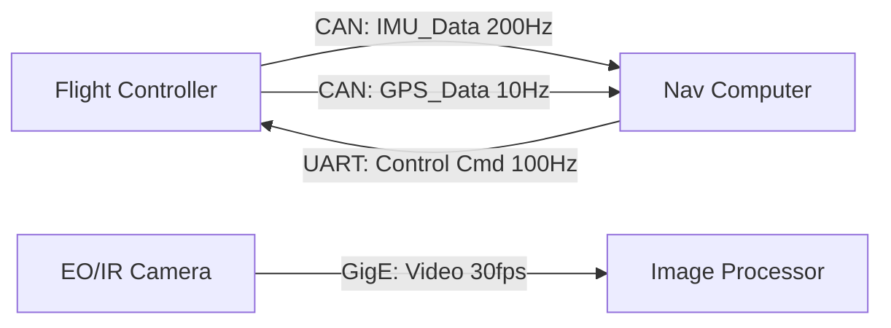

# InterfaceForge

인터페이스를 단조(Forge)한다는 느낌 + 전문가용 툴 이미지 + ICD 생성 도구라는 정체성을 잘 전달.

iforge (CLI comand: iforge init, iforge build 등).


# ICD (Interface Control Document) 자동 생성 시스템 구상

**ICD** — Inter-Computer(face) Control Document  
장비 간 인터페이스(신호, 메시지, 버스, 프로토콜)를 정의하는 설계 문서.

> 기존 방식: 수기 작성 (Excel, DOORS, MagicDraw) → 자동화 대상

---

## 1. ICD의 본질

ICD가 정의하는 것은 **정형화된 데이터의 집합**:

```
[장비 A] ──메시지──→ [장비 B]
  - 무엇을 (Message ID / Signal Name)
  - 언제 (Period / Trigger)
  - 얼마나 자주 (Rate / Latency requirement)
  - 얼마나 큰 (Data size / Payload)
  - 어떻게 (Protocol / Encoding)
  - 어디로 (Bus / Physical layer)
```

표 형태로 완전히 정형화 가능 → **자동 생성과 계산에 가장 적합한 도메인** 중 하나.

---

## 2. 전체 시스템 구조

```
[사용자 입력]
  ├─ 장비 정의 (Equipment)
  ├─ 인터페이스 정의 (Bus/Protocol)
  └─ 메시지 정의 (Message/Signal)
         ↓
[계산 엔진]
  ├─ ① Bus Utilization 계산 (대역폭 점유율)
  ├─ ② Timing 분석 (Worst-case latency, Deadline miss)
  ├─ ③ CPU 부하 예측
  └─ ④ 병목 검출 및 권장 주기 제안
         ↓
[자동 생성]
  ├─ ICD 문서 (Markdown / Excel / CSV)
  ├─ 인터페이스 다이어그램 (PlantUML / Mermaid)
  ├─ ROS2 .msg / DDS IDL
  └─ 경고 리포트 (Bus 초과, Deadline miss)
```

---

## 3. 데이터 모델

### 3.1 Equipment (장비)

| 필드 | 타입 | 예시 |
|---|---|---|
| id | string | `eo_ir_cam_01` |
| name | string | EO/IR Camera |
| category | enum | 영상 / 비행제어 / 센서 / 통신 / 제어 / 전력 / 저장 |
| cpu_spec | string | Jetson Orin Nano 6-core |
| memory_mb | int | 8192 |
| os | string | Ubuntu 22.04 / RTOS / Baremetal |

### 3.2 Interface (버스/프로토콜)

| 필드 | 타입 | 예시 |
|---|---|---|
| id | string | `can1` |
| type | enum | CAN / CAN-FD / UART / RS422 / Ethernet / PCIe / SPI / I2C / GPIO |
| role | enum | Primary / Redundant / Diagnostic |
| speed | float | CAN: 1 Mbps, Ethernet: 1000 Mbps |
| encoding | string | Little Endian / Big Endian |
| protocol_layer | string | UDP / TCP / RAW / J1939 / Custom |

### 3.3 Message (메시지)

| 필드 | 타입 | 예시 |
|---|---|---|
| id | string | `imu_data_01` |
| name | string | IMU_Data |
| source | string (equipment id) | `flight_ctrl_01` |
| target | string (equipment id) | `nav_comp_01` |
| direction | enum | TX / RX / TXRX |
| period_ms | int | 5 (200 Hz) |
| max_latency_ms | int | 10 |
| priority | int | 1 (highest) ~ 255 |
| size_bytes | int | 32 |
| bus_id | string | `can1` |

### 3.4 Signal (신호 — 메시지 내 개별 데이터)

| 필드 | 타입 | 예시 |
|---|---|---|
| name | string | accel_x |
| type | enum | float / double / int32 / uint16 / bool / enum |
| bit_offset | int | 0 |
| bit_length | int | 32 |
| unit | string | m/s² |
| range_min | float | -16.0 |
| range_max | float | 16.0 |
| resolution | float | 0.001 |
| description | string | X-axis acceleration |

---

## 4. 계산 엔진

### 4.1 Bus Utilization (버스 점유율)

```
U_bus = Σ ( message_rate × message_size / bus_speed )

CAN Bus:
  32 bytes @ 200 Hz = 32 × 8 × 200 = 51,200 bps
  Utilization = 51,200 / 1,000,000 = 5.12%

Ethernet:
  900 KB @ 30 Hz = 900,000 × 8 × 30 = 216 Mbps
  Utilization = 216 / 1000 = 21.6%
```

| 임계치 | 의미 | 조치 |
|---|---|---|
| < 30% | 여유 | 안전 |
| 30~50% | 주의 | 증가 가능성 모니터링 |
| 50~70% | 경고 | 일부 메시지 주기 조정 권장 |
| > 70% | 위험 | 버스 분할 또는 물리 계층 업그레이드 필요 |

### 4.2 Timing 분석 (Rate Monotonic Scheduling)

각 메시지의 주기와 최대 지연 시간을 기준으로 **Deadline miss 가능성**을 계산:

```
WCRT_i = C_i + Σ (ceil(WCRT_i / T_j) × C_j)   (j: higher priority tasks)

여기서:
  C_i = message transmission time (size / speed)
  T_j = period of higher priority message j
  
→ WCRT_i > deadline_i → Deadline miss 발생 → 경고
```

### 4.3 CPU 부하 예측

```
CPU_load = Σ ( message_rate × processing_time_per_message )
  
→ 가용 CPU 코어 수 대비 총 부하 계산
→ 실시간 태스크 보장 여부 판단
```

### 4.4 권장 주기 제안

```
if U_bus > 50%:
  해당 버스의 메시지 중 priority 낮고 period 짧은 것 탐색
  → period를 2배로 늘렸을 때 utilization 감소 계산
  → 감소율이 가장 큰 조합 추천

if CPU_load > 70%:
  processing cost가 높은 센서 sampling rate 감소 추천
```

---

## 5. 출력 생성

### 5.1 ICD 문서 (Markdown / Excel)

자동 생성 예시:

```
# ICD: Flight Controller ↔ Navigation Computer

## Interface: CAN1 (1 Mbps)

| Message | Dir | Rate | Size | Prio | Utilization |
|---|---|---|---|---|---|
| IMU_Data | TX | 200 Hz | 32 B | 1 | 5.12% |
| GPS_Data | TX | 10 Hz | 24 B | 3 | 0.19% |
| Mag_Data | TX | 50 Hz | 16 B | 2 | 0.64% |
| **Total** | | | | | **5.95%** ✅ |

## Message: IMU_Data (ID: 0x100)

| Signal | Type | Offset | Length | Unit | Range |
|---|---|---|---|---|---|
| accel_x | float | 0 | 32 | m/s² | ±16g |
| accel_y | float | 32 | 32 | m/s² | ±16g |
| accel_z | float | 64 | 32 | m/s² | ±16g |
| gyro_x | float | 96 | 32 | °/s | ±2000 |
| gyro_y | float | 128 | 32 | °/s | ±2000 |
| gyro_z | float | 160 | 32 | °/s | ±2000 |
```

### 5.2 인터페이스 다이어그램 (Mermaid)



### 5.3 ROS2 .msg 파일 생성

```
# IMU_Data.msg (auto-generated)
float32 accel_x    # unit: m/s², range: ±16g
float32 accel_y    # unit: m/s², range: ±16g
float32 accel_z    # unit: m/s², range: ±16g
float32 gyro_x     # unit: °/s, range: ±2000
float32 gyro_y     # unit: °/s, range: ±2000
float32 gyro_z     # unit: °/s, range: ±2000
```

---

## 6. 장비 분류 체계 (안)

| 분류 | 포함 장비 예시 | 주요 인터페이스 |
|---|---|---|
| **영상** | EO/IR, SWIR, MWIR, LiDAR, Camera | GigE, CoaXPress, USB3 |
| **비행제어** | Flight Controller, Autopilot, IMU, GPS | CAN, UART, SPI |
| **센서** | Temperature, Pressure, Radar, Sonar | I2C, CAN, RS422 |
| **제어** | Servo Driver, Motor Controller, Actuator | PWM, CAN, EtherCAT |
| **통신** | Data Link, RF Modem, Antenna | Ethernet, UART |
| **전력** | PMU, Battery, Power Distribution | I2C, CAN |
| **저장/처리** | Mission Computer, Nav Computer, GPU | PCIe, Ethernet |

---

## 7. 개발 난이도

| 모듈 | 난이도 | 비고 |
|---|---|---|
| Equipment / Message 정의 Editor | 하 | YAML/JSON Schema + 간단한 폼 |
| Bus Utilization 계산 | 하 | 산술 연산 |
| Timing 분석 (RMA) | 중 | Rate Monotonic Scheduling 알고리즘 |
| ICD 문서 생성 | 중 | Template + Excel export (openpyxl) |
| 다이어그램 생성 | 중 | Mermaid / PlantUML 텍스트 생성 |
| ROS2 msg / IDL 생성 | 중 | String template 기반 codegen |
| 권장 주기 최적화 | 중상 | 단순 Constraint solver 또는 휴리스틱 |
| Web UI | 중-상 | React + D3.js (선택 사항) |

---

## 8. 입력 예시 (전체 YAML)

```yaml
# icd_project.yaml

project:
  name: "UAV Flight Control System"
  version: "1.0"
  date: "2026-06-02"

equipment:
  - id: "flight_ctrl"
    name: "Flight Controller"
    category: "비행제어"
    cpu: "STM32H743"
    os: "FreeRTOS"
    interfaces:
      - id: "can1"
        type: "CAN"
        speed_mbps: 1
      - id: "uart1"
        type: "UART"
        baud: 115200

  - id: "nav_comp"
    name: "Navigation Computer"
    category: "저장/처리"
    cpu: "Jetson Orin Nano"
    os: "Ubuntu 22.04"
    interfaces:
      - id: "can1"
        type: "CAN"
        speed_mbps: 1
      - id: "eth0"
        type: "Ethernet"
        speed_mbps: 1000

  - id: "eo_ir_cam"
    name: "EO/IR Camera"
    category: "영상"
    interfaces:
      - id: "eth0"
        type: "Ethernet"
        speed_mbps: 1000

messages:
  - name: "IMU_Data"
    source: "flight_ctrl"
    target: "nav_comp"
    direction: TX
    period_ms: 5
    max_latency_ms: 10
    priority: 1
    size_bytes: 32
    bus_id: "can1"
    signals:
      - {name: "accel_x", type: "float", unit: "m/s²", range: "-16~16"}
      - {name: "accel_y", type: "float", unit: "m/s²", range: "-16~16"}
      - {name: "accel_z", type: "float", unit: "m/s²", range: "-16~16"}
      - {name: "gyro_x", type: "float", unit: "°/s", range: "-2000~2000"}
      - {name: "gyro_y", type: "float", unit: "°/s", range: "-2000~2000"}
      - {name: "gyro_z", type: "float", unit: "°/s", range: "-2000~2000"}

  - name: "Video_Stream"
    source: "eo_ir_cam"
    target: "nav_comp"
    direction: TX
    period_ms: 33
    priority: 5
    size_bytes: 921600
    bus_id: "eth0"
    signals:
      - {name: "frame_data", type: "uint8[]", description: "640x480x3 raw"}

  - name: "Control_Cmd"
    source: "nav_comp"
    target: "flight_ctrl"
    direction: TX
    period_ms: 10
    priority: 2
    size_bytes: 8
    bus_id: "can1"
    signals:
      - {name: "roll_cmd", type: "float", unit: "deg"}
      - {name: "pitch_cmd", type: "float", unit: "deg"}
```

---

## 9. 출력 예시 (자동 생성 리포트)

```
======================================================================
 ICD AUTO-GENERATION REPORT
 Project: UAV Flight Control System
 Generated: 2026-06-02
======================================================================

[장비]
  1. Flight Controller   (비행제어)  — STM32H743, FreeRTOS
  2. Navigation Computer (저장/처리) — Jetson Orin Nano, Ubuntu
  3. EO/IR Camera        (영상)     — GigE Vision

[인터페이스]
  CAN1 (1 Mbps): Flight Controller ↔ Navigation Computer
  ETH0 (1 Gbps): Navigation Computer ↔ EO/IR Camera

[Bus Utilization]
  CAN1 :   5.95%  ✅ (임계치 50% 이내)
  ETH0 :  21.60%  ✅ (임계치 70% 이내)

[Timing]
  IMU_Data    (200 Hz): WCRT=1.2ms / Deadline=10ms ✅
  Control_Cmd (100 Hz): WCRT=0.8ms / Deadline=20ms ✅
  Video_Stream (30 Hz): WCRT=7.4ms / Deadline=100ms ✅

[경고]
  - 없음

[권장]
  - 모든 버스 여유 충분, 현재 설정 유지 권장
======================================================================
```

---

## 10. 확장 아이디어

| 기능 | 설명 |
|---|---|
 | **SysML/xml 임포트** | MagicDraw/Cameo에서 작성한 모델 가져오기 |
| **변경 영향도 분석** | 특정 메시지 주기 변경 시 영향 받는 모든 버스/장비 표시 |
| **버전 관리** | ICD 리비전 간 Diff 출력 |
| **Simulink 연동** | Simulink 모델의 Inport/Outport → ICD 메시지 자동 매핑 |
| **테스트 벡터 생성** | 각 메시지의 CRC/Checksum 테스트용 입력 값 자동 생성 |
| **하네스/배선 정보** | Physical pin mapping, 커넥터 타입까지 확장 |

---

## 참고

- 현재 군수/항공 ICD는 DOORS, Excel, MagicDraw SysML이 주류 — 자동 생성기 시장에 경량 솔루션 부재
- ROS2 생태계의 `.msg` / DDS `IDL` 과 직접 연결 가능
- 단순 문서 생성기를 넘어 **설계 검증 도구**로 발전 가능

 
